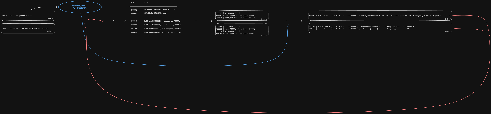

# Diseño de PageRank con MapReduce

**Autor:** Ricardo Arias

**Fecha:** 2026-08-29

## 1. Representación de los datos

Cada elemento que recibe el mapper representa el estado completo de un nodo:

```python
(node, rank, neighbors)
```

| Campo | Tipo | Significado |
|---|---|---|
| `node` | `str` | Identificador único de la página. |
| `rank` | `float` | PageRank actual de la página. |
| `neighbors` | `tuple[str, ...]` | Páginas enlazadas por el nodo. Puede estar vacía. |

Ejemplo:

```python
row = ("P00027", 0.0124, ("P00051", "P00089"))
```

El estado contiene simultáneamente el rank y la adyacencia porque la salida de
una iteración se convierte en la entrada de la siguiente.

## 2. Esquema clave-valor por fase

### Map

Por cada nodo, el mapper emite dos tipos de mensajes etiquetados:

| Tipo | Clave | Valor | Cantidad | Propósito |
|---|---|---|---:|---|
| `STRUCT` | Nodo de origen | `("STRUCT", neighbors)` | 1 por nodo | Preservar la lista de adyacencia. |
| `RANK` | Nodo de destino | `("RANK", rank / out_degree)` | 1 por arista | Enviar una contribución de PageRank. |

Para un nodo `A` con rank `0.6` y vecinos `B` y `C`, se produce:

```text
(A, (STRUCT, [B, C]))
(B, (RANK, 0.3))
(C, (RANK, 0.3))
```

La clave de una contribución es el **destino**, no el origen. De esta manera,
el shuffle reúne en un solo grupo todas las contribuciones recibidas por una
página.

### Shuffle

Para cada página `P`, el shuffle agrupa:

```text
P -> [un mensaje STRUCT, cero o más mensajes RANK]
```

Una página sin enlaces entrantes conserva su grupo gracias a su mensaje
`STRUCT`, aunque no reciba ningún mensaje `RANK`.

### Reduce

El reducer recupera `neighbors`, suma las contribuciones entrantes y calcula:

```text
new_rank(P) = (1 - d) / N + d * (incoming(P) + dangling_mass / N)
```

Su valor reducido vuelve a tener la forma esperada por el mapper:

```python
(node, new_rank, neighbors)
```

## 3. Preservación de la estructura del grafo

Cada nodo emite exactamente un mensaje `STRUCT`. El reducer lo copia sin
modificar al estado reducido. Así, la lista de adyacencia sobrevive y puede
utilizarse en la próxima iteración.

Si únicamente se emitieran contribuciones `RANK`, después de la primera pasada
se conocerían los ranks nuevos, pero se perderían los enlaces salientes. La
siguiente iteración ya no podría distribuir esos ranks.

## 4. Manejo de nodos colgantes

Antes de cada llamada a `mapreduce()`, el bucle externo calcula la masa total de
los nodos sin enlaces salientes:

```text
dangling_mass = suma de los ranks de los nodos sin vecinos
```

El reducer distribuye `dangling_mass / N` a cada nodo antes de aplicar el
factor de amortiguación. Esta distribución uniforme evita que el rank de los
nodos colgantes desaparezca y preserva la invariante:

```text
Σ rank(P) ≈ 1.0
```

## 5. Iteración y convergencia

El bucle vive en `_run_pagerank()`, fuera de `mapreduce()`. En cada vuelta:

1. Se guardan los ranks actuales en `old_ranks`.
2. Se calcula `dangling_mass`.
3. Se ejecuta una pasada Map–Shuffle–Reduce.
4. La salida reducida se convierte en el nuevo estado.
5. Se calcula la diferencia L1:

```text
L1 = Σ |new_rank(P) - old_rank(P)|
```

El proceso termina cuando `L1 < epsilon` o cuando alcanza `max_iter`. La
configuración predeterminada usa `d = 0.85`, `epsilon = 10⁻⁶` y un máximo de 50
iteraciones.

## 6. Flujo de una iteración


